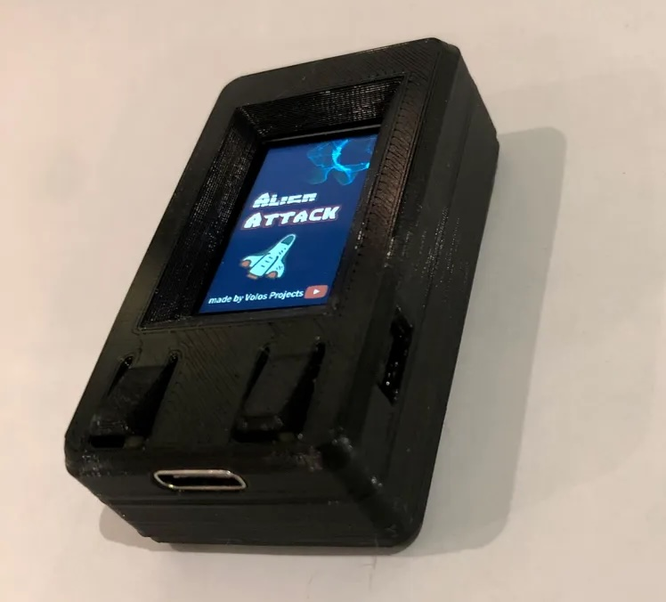
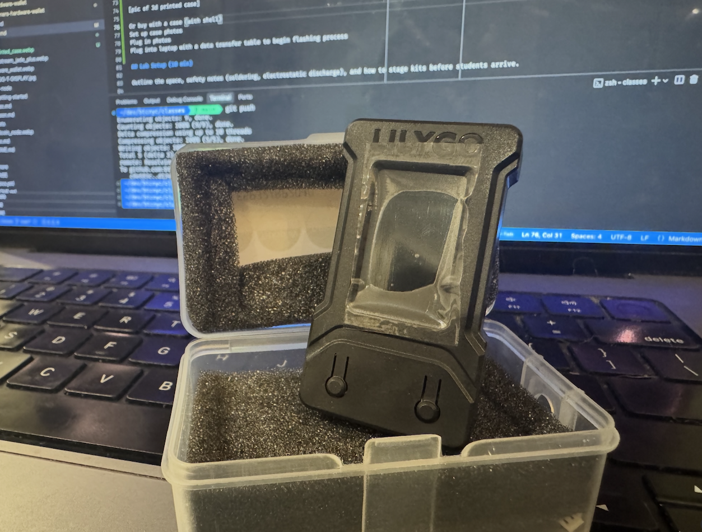
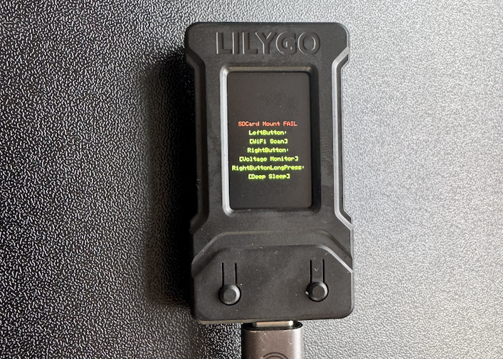
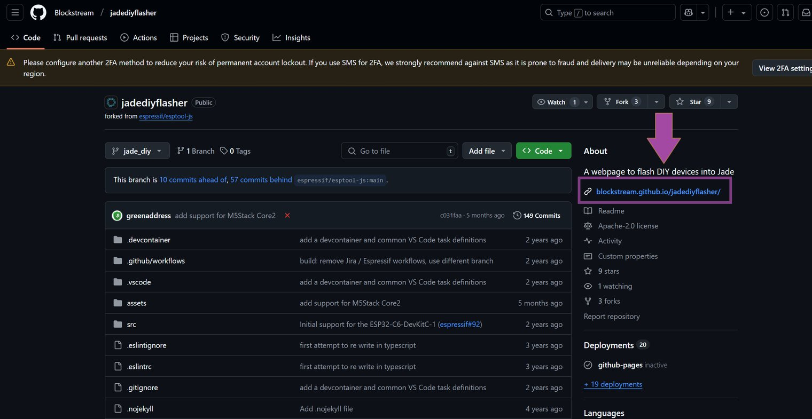
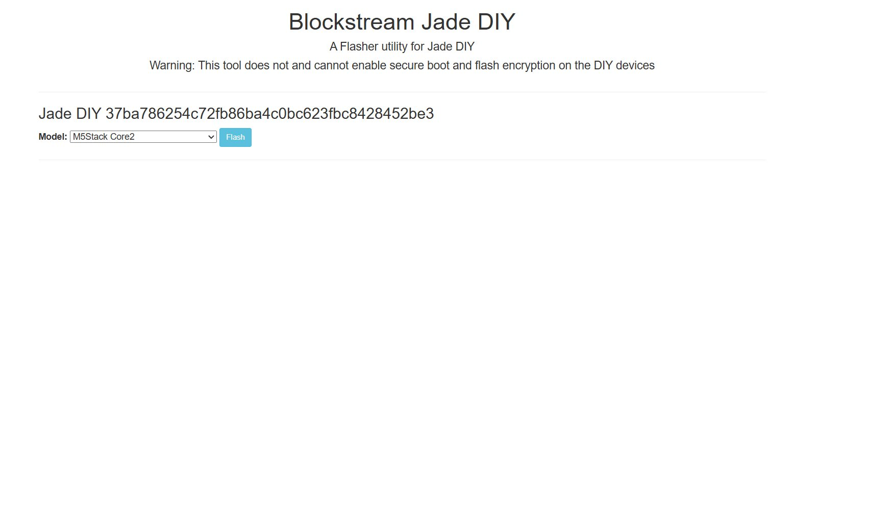
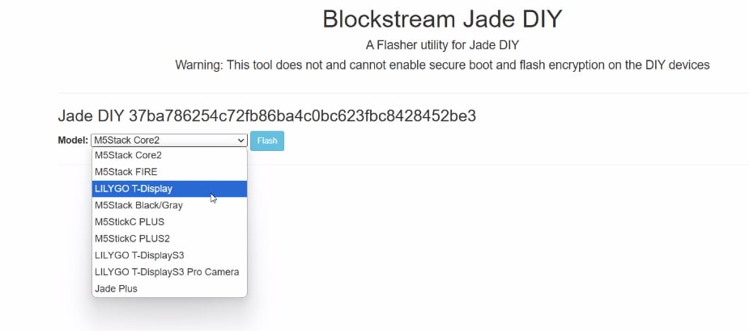
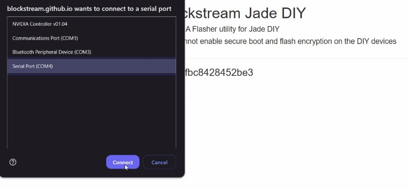

> 📅 **Looking for date/time/location?**  
> See the current [Event Page](./index.md)

{ width="100%" }

# Bitcoin Hardware Wallet · Beginner Build

**Audience:** Curious builders with little-to-no embedded experience.

**Duration:** 2 hours (flexible)

**Outcomes:** By the end, students will:

* Recognize the security model of DIY hardware wallets versus commercial devices.
* Assemble a microcontroller-based signing device.
* Flash open-source firmware and verify the build checksum.
* Sign and broadcast a mainnet transaction using their new device.

---

## Abstract

This 2-hour workshop teaches beginners to build a functional Bitcoin hardware wallet by flashing open-source Jade firmware onto a $15 LilyGO T-Display board. Students transform generic development hardware into a signing device comparable to commercial wallets costing $150, learning security fundamentals through hands-on experience rather than theory alone.

### Philosophy

Building your own signing device isn't just about saving money—it's about understanding the technology protecting your Bitcoin. This workshop embraces "security through understanding" over black-box trust. By sourcing components, flashing open-source firmware, and generating entropy themselves, students reduce supply chain risk while learning to evaluate security claims critically. The goal is informed autonomy: students should understand both the power and limitations of their DIY device compared to hardened commercial alternatives.

---

## Concept Primer (15 min)

### What is Self-Custody and Why Does it Matter?
Bitcoin was created to remove the need for trusted third parties, like banks and corporations, from our money system. Instead of using trust, bitcoin uses math, physics, and cryptography to allow anyone the power to own and control their money without needing anyone’s permission.

The way this works is that bitcoin exists on a global digital ledger called the blockchain aka the bitcoin timechain, which is a public and transparent ledger run by computers, instead of a centralized ledger like a bank account. 

The important thing to understand is that in order to move bitcoin from one place to another, you have to sign that transaction with what's called a private key. Think of it like unlocking a vault with a password, and moving the bitcoin to someone else's vault. In this way, the keys to the vault are the money itself. Bitcoin gives you the power to hold the keys to that vault yourself, instead of relying on a bank to move your money for you. This is where the phrase "not your keys, not your coins" comes from.

Self-custody means holding your own private keys, and controlling your own bitcoin. If you don’t hold that key, you’re trusting someone else to hold it for you. If your bitcoin is in an ETF or on an exchange (Mt. Gox, FTX, Coinbase, Binance, etc.), you don’t own bitcoin, you own a claim to bitcoin. This introduces all kinds of risks, like exchanges getting hacked and losing your bitcoin or companies lending out your money and giving you only a fraction in reserve. Additionally trusted third parties would have full control of your money and could limit or freeze withdrawals. 

With self-custody you remove trust from the equation. No one can freeze your funds or deny a transaction, you can send money across borders, to anyone, at any time, and you don’t need a bank account, an ID, or anyone’s approval. No one can stop you, censor you, or steal from you, unlocking the full power of bitcoin as freedom money. This is why we say, with bitcoin you can be your own bank. 

Bitcoin was created to solve the problem of the manipulation of trust and money, an opt out of our current system, but the exit only works if you take the keys. This is why self-custody is so important. 

### What is a Wallet?
### Hot vs Cold Wallets

### Hardware Wallet Threat Model
Hardware wallets exist to solve a fundamental problem: how do you sign Bitcoin transactions without exposing your private keys to an internet-connected computer that could be compromised by malware or remote attackers? The core threat model assumes your everyday laptop or phone is potentially hostile. A hardware wallet creates an isolated environment where private keys never leave the device, and transaction signing happens in a secure element or microcontroller that only communicates the signature back to the host computer, not the key itself. Even if your computer is completely compromised, an attacker can't steal your Bitcoin without physical access to the device and your PIN.

However, hardware wallets introduce their own threats. You must trust the manufacturer hasn't introduced backdoors, the supply chain hasn't been tampered with, and the random number generation is truly random. Physical attackers might extract keys through side-channel attacks or chip manipulation, and someone with temporary access could modify your device. Building your own hardware wallet helps you understand these tradeoffs—you'll make decisions about secure elements versus general-purpose microcontrollers, how to verify transactions on a display, and how to protect against both remote and physical threats. The goal isn't perfect security, but understanding which threats you're protecting against and which ones remain.

### Key Concepts
- **Entropy and seed phrases:** Your wallet is only as safe as the randomness that births it. We will mix the device's random number generator with human-friendly tricks like dice rolls, convert that entropy into a 12- or 24-word [BIP39 phrase](https://github.com/bitcoin/bips/blob/master/bip-0039.mediawiki), and leave the room with a written or metal backup you trust.
- **Seed phrase hygiene:** Treat the seed like master keys to your savings. Never type the words into a phone or computer—keyloggers, screenshots, and cloud backups can leak it forever. Keep the phrase offline, store it somewhere only you can access, and practice reading it back aloud before you leave.
- **Secure element + microcontroller:** Think of the secure element as the vault and the microcontroller as the brains. The secure element guards private keys with tamper resistance, while the microcontroller handles the screen, buttons, and firmware logic. Note that the hardware wallets we are building today do not have a secure element. This doesn't mean it's insecure, just that it has one less level of protection.
- **Trusting firmware:** Firmware is the invisible operating system of the wallet. Always download from tagged releases, check the published hash, and understand that reproducible builds let multiple people compile the same code and arrive at the exact same binary. If the checksum does not match, you do not sign.

---

## What Are We Building? 
We are taking generic hardware, the LilyGo T-Display, and flashing Jade SDK firmware on it. The [Jade Plus](https://blockstream.com/jade/jade-plus/) is an open-source wallet, which typically costs $150:

Today, we'll be flashing their firmware onto a $15 hardware instead.

### What to Buy

{ width="70%" }

- **LilyGO T-Display (16MB with shell, model K164)** — [Order direct from LilyGO](https://lilygo.cc/products/t-display?srsltid=AfmBOornob5U3FzZifuSwBBOdeXKcdPDqkYEnAVYKBLdzl0BPyNglGBR) for about $15. This ESP32 board provides the display, buttons, and USB interface that mirror Blockstream's Jade Plus. The onboard ESP32 also includes Wi-Fi and Bluetooth radios; we'll ship firmware that keeps them disabled, but they shape your threat model because malicious code could switch them back on.
- **USB-C cable** — Bring a data-capable cable so you can flash firmware and power the board straight from your laptop (totally fine for class use).

### Why Build Your Own Hardware Wallet?

- Save roughly $135 versus buying a commercial device.
- Build comfort with firmware flashing, secure elements, and wallet hygiene.
- Spin up additional signing devices to spread savings across multiple wallets.
- Reduce supply chain risk by sourcing and assembling every component yourself.
- Keep Lopp's mantra in mind: sovereignty and convenience are always at odds.

## Physical Set Up

### Prepare Your Case

You have two options for housing your LilyGO T-Display board: a 3D printed case or the official LilyGO enclosure. The printed case can be found and printed from [this model](https://www.printables.com/model/119144-lilygo-ttgo-t-display-enclosure). It offers a lightweight and customizable shell for your device.

Alternatively, you can use the official LilyGO case, which provides a slightly different fit and finish, offering more robust protection and a polished look.

Note that the printed and official cases differ slightly in design and assembly. Whichever option you choose, ensure the board is properly seated inside the case to avoid loose connections or damage.

### Inspect the Board

Before proceeding, carefully inspect your LilyGO T-Display board for any visible defects or debris. Check that the display, buttons, and USB-C port are clean and free of dust or solder splashes. Handle the board with care, and observe electrostatic discharge (ESD) safety by grounding yourself or using an ESD wrist strap to prevent damage to sensitive components.

### Connect to Your Laptop

Using a data-capable USB-C cable, connect the LilyGO board to your laptop. This connection will provide power and allow you to flash the firmware.

On boot, you will be greeted with the following screen:

When powered on, the LilyGO will display a color test screen cycling through solid colors. This confirms the display and board are functioning correctly before flashing firmware.

Once the color test completes, the screen will settle on a default state, indicating the board is ready for the next steps in the build process.

## The Easy Way or the Hard Way

There are two main approaches to flashing your hardware wallet firmware: the easy way and the hard way. The easy way utilizes pre-configured tools or web-based flashers that automatically load the firmware onto your device with minimal input. This method is ideal for beginners who want a quick win or prefer to avoid the complexities of debugging and command-line interactions. It simplifies the process and gets you up and running faster, making it accessible for those new to embedded development or hardware wallets.

The hard way, on the other hand, involves manually using command-line tools to flash the firmware. This approach requires verifying firmware signatures and checksums to ensure authenticity and integrity, giving you a deeper understanding of the flashing process and how the firmware interacts with the hardware. While it demands more effort and familiarity with terminal commands, it offers greater control, transparency, and confidence in your device’s security.

Each method has its tradeoffs: the easy way sacrifices some degree of trust and understanding for speed and convenience, whereas the hard way requires more time and technical skill but rewards you with flexibility and a stronger grasp of the underlying technology. Instructors should encourage students to choose the path that best aligns with their comfort level and curiosity, fostering both confidence and exploration.

## The Easy Way

The easiest way to flash a ESP32

1. Go to the official Blockstream Github: [https://github.com/Blockstream/jadediyflasher](https://github.com/Blockstream/jadediyflasher)  
   

2. You can download the source file and run the website locally, but GitHub already hosts it at [https://blockstream.github.io/jadediyflasher/](https://blockstream.github.io/jadediyflasher/). GitHub serves the HTML, CSS, JavaScript, etc. directly to your browser so you can flash the device without installing developer tools.  
   

3. Open the dropdown menu (it likely defaults to `M5Stack Core2`) and select your development board — for this class, pick `LILYGO T-Display`.  
   

4. When you click flash this is going to appear. In order to know which device is the LILYGO, unplug the lilygo and plug it back in. The com port that the lilygo will appear and disappear. Click the COM port that the Jade is plugged into
   

5. That's it a progress bar should show up and when it's finish your ready to set it up

## Setting up the Jade Wallet

Once the firmware is successfully flashed, your LilyGO T-Display is now a fully functional Jade hardware wallet. This section will walk you through the initial setup process, from generating your seed phrase to connecting the device with wallet software like Sparrow or the Blockstream Green mobile app.

### Initial Boot and Device Setup

1. **Power on the device:** With the LilyGO still connected to your laptop via USB-C, the Jade firmware should boot automatically. You'll see the Jade logo appear on the display.

2. **Enter setup mode:** The device will present you with an initial menu. Use the two physical buttons on the board to navigate:
   - **Left button:** Move up/back
   - **Right button:** Move down/forward
   - **Both buttons simultaneously:** Select/confirm

3. **Select "Setup":** Navigate to the Setup option and press both buttons to confirm. The device will guide you through the initial configuration process.

### Creating Your Wallet

4. **Choose "Begin Setup":** The device will prompt you to begin the wallet creation process. Confirm your selection.

5. **Select "Create New Wallet":** You'll be presented with two options:
   - **Create New Wallet:** Generates a fresh seed phrase (choose this for the workshop)
   - **Restore Wallet:** Recover an existing wallet from a seed phrase (for advanced users)

   Select "Create New Wallet" and confirm.

6. **Generate entropy:** The device will use its random number generator to create cryptographic entropy. This process takes a few seconds as the device gathers randomness from multiple sources.

### Recording Your Seed Phrase

7. **Write down your seed phrase:** The device will now display a 12-word BIP39 seed phrase, one word at a time. This is the most critical step in the entire process.

   **Important security practices:**
   - Write each word clearly on paper (use the provided seed phrase cards if available)
   - Double-check each word as you write it
   - Never photograph the seed phrase with your phone
   - Never type the words into any computer or phone
   - Keep your seed phrase private—don't share your screen or show others

8. **Verify your seed phrase:** After writing down all 12 words, the device will ask you to confirm several words from the phrase to ensure you recorded them correctly. Use the buttons to select the correct word for each prompt.

   **Pro tip:** Before moving on, practice reading your seed phrase back to yourself aloud (quietly, so others can't hear). This helps catch any handwriting errors or ambiguities.

### Connection Method

9. **Choose connection type:** The Jade firmware supports two connection methods:
   - **USB:** Wired connection via USB-C cable (recommended for this workshop)
   - **Bluetooth:** Wireless connection to mobile devices

   Select **USB** for now, as it's the most straightforward option for desktop wallet software and doesn't introduce wireless attack vectors.

10. **Device naming:** The Jade will display a unique identifier like "Connect Jade A7D924". This identifier helps you distinguish between multiple hardware wallets if you end up building more than one. Make a note of this identifier if desired.

### Connecting to Wallet Software

You now have two main options for interfacing with your newly created hardware wallet: the Blockstream Green mobile app (for on-the-go use) or Sparrow Wallet (for desktop use with more advanced features). For this workshop, we'll focus on Sparrow Wallet, as it offers better visibility into the technical details of Bitcoin transactions.

#### Option 1: Blockstream Green Mobile App (Quick Start)

If you want to test your device quickly with a mobile device:

1. Download the **Blockstream Green** app from the App Store (iOS) or Google Play (Android)
2. Open the app and select "Connect Hardware Wallet"
3. Choose "Jade" from the list of supported devices
4. Plug your Jade into your phone using a USB-C to USB-C cable (or USB-C to Lightning adapter for iPhone 15+)
5. Follow the on-screen prompts to connect and create your first wallet

**Note about Liquid:** The Blockstream Green app supports both Bitcoin and Liquid (a Bitcoin sidechain). If you're using Liquid features, you may be prompted to "Export master blinding key"—this allows the app to see transaction amounts on the Liquid network, which are otherwise confidential. For this workshop, you can skip Liquid features and focus on standard Bitcoin transactions.

#### Option 2: Sparrow Wallet (Recommended for Workshop)

Sparrow Wallet is a powerful desktop application that gives you granular control over your Bitcoin transactions and connects seamlessly with your Jade hardware wallet.

**Installation:**

1. Download Sparrow Wallet from the official website: [sparrowwallet.com](https://sparrowwallet.com)
2. Verify the download signature (see the Sparrow documentation for details)
3. Install and launch the application

**Connecting Your Jade to Sparrow:**

1. In Sparrow, go to **File → New Wallet**
2. Give your wallet a name (e.g., "My Jade Wallet")
3. Click **Connected Hardware Wallet**
4. Sparrow should automatically detect your plugged-in Jade device
5. If prompted, confirm the connection on the Jade display by pressing both buttons
6. Select your desired script type:
   - **Native Segwit (P2WPKH):** Recommended for beginners—lowest fees, widest compatibility with modern wallets
   - **Nested Segwit (P2SH-P2WPKH):** For compatibility with older services
   - **Taproot (P2TR):** Most advanced, offers best privacy and lowest fees, but requires cutting-edge wallet support
7. Click **Import Keystore** to complete the connection

**Configuring Sparrow's Server Connection:**

Before you can see your balance or broadcast transactions, Sparrow needs to connect to a Bitcoin node to fetch blockchain data. You have several options, each with different tradeoffs between convenience, privacy, and trust:

- **Public Electrum Server (Easiest, least private):** Connects to a public server operated by a third party. Quick to set up, but the server can see your wallet's addresses and potentially link them to your IP address. Good for testing on testnet.
  - In Sparrow, go to **Tools → Preferences → Server**
  - Select **Public Server** and choose a server from the list
  - Click **Test Connection** to verify

- **Bitcoin Core or Knots Node (Most private, most work):** Run your own full Bitcoin node. This is the gold standard for privacy and verification, as you're validating every transaction yourself and not trusting anyone else's server. However, it requires downloading the entire blockchain (~600GB) and keeping your node synced.
  - Install and sync Bitcoin Core or Knots
  - In Sparrow, go to **Tools → Preferences → Server**
  - Select **Bitcoin Core or Knots** and enter your node's connection details

- **Private Electrum Server (Good balance):** Host your own Electrum server (like Fulcrum or Electrs) connected to your Bitcoin Core or Knots node. Offers full privacy without needing to run Sparrow on the same machine as your node.
  - Set up an Electrum server pointing to your Bitcoin Core or Knots node
  - In Sparrow, go to **Tools → Preferences → Server**
  - Select **Private Electrum** and enter your server's URL

For this workshop, using a **Public Electrum Server** is perfectly fine for testnet transactions. In a production environment with real funds, you'd want to consider running your own node or using a trusted private server for maximum privacy.

#### Option 3: Blockstream Green Desktop App (Quick Start)

Blackstream Green is the software to finish setting up the JadeDIY and it must be with the desktop version

1. Get the official Blockstream application this is the link to it from their website when your there click [download now](https://blockstream.com/app/)

2. Depending on where your downloads go most likely it will be in your download folder check there and double click the executable file to install the software.

3. Might have to give admin right in order to run the installer once you did that a new window will pop up that should look like the following picture and you hit next

4. make sure where you want the installaed application to remain is in a location that either most of your programs are or somewhere easy to find and then hit next

5. Installer will ask what you want your shortcut name to be once you have a name or stick with the default click next  

6. If you want to create a desktop shortcut hit that checkmark otherwise click next

7. And finally it will ask if you want to install click the install button and wait a few minutes

8. The bar should fill to the end

9. when it is filled to the end then and new page will show and you just need to click finish

10. Find your newly installed application blockstream the following is an example of how i found it in my start menu on windows 11

11. Once you find it click to launch a spash screen should show up
### Verifying Your Setup

Once connected to Sparrow (or another wallet application):

1. **Check your addresses:** Sparrow will display receiving addresses derived from your seed phrase. You can verify an address on your Jade device by going to the "Receive" tab in Sparrow and clicking "Display Address"—the address should appear on both your computer screen and the Jade display.

2. **Generate a receiving address:** Click the **Receive** tab in Sparrow and copy your first Bitcoin receiving address. 

3. **Ready for transactions:** Your hardware wallet is now fully configured and ready to receive and sign Bitcoin transactions. Proceed to the next section to practice signing a testnet transaction.

---

### Quick Setup Checklist

<ul class="task-list" style="list-style: none; padding-left: 0;">
<li><label><input type="checkbox"> Jade firmware boots successfully</label></li>
<li><label><input type="checkbox"> New wallet created with 12-word seed phrase</label></li>
<li><label><input type="checkbox"> Seed phrase written down clearly and verified</label></li>
<li><label><input type="checkbox"> USB connection mode selected</label></li>
<li><label><input type="checkbox"> Wallet software (Sparrow) installed and connected</label></li>
<li><label><input type="checkbox"> Server connection configured (public Electrum for mainnet)</label></li>
<li><label><input type="checkbox"> First receiving address generated and verified on device</label></li>
</ul>

If all items are checked, you're ready to move on to the signing practice section!

## Practice Signing (30 min)

Walk through creating a testnet transaction, signing it with the new device, and broadcasting via Sparrow or Specter.

---

## Troubleshooting Guide

Provide quick fixes for common hardware issues (bad solder joints, loose ribbon cables) and firmware hiccups (driver install, boot loops).

---

## Stretch Goals & Next Steps

- Integrate multisig support.
- Explore alternative firmware (e.g., Krux, SeedSigner forks).
- Harden the physical enclosure and tamper seals.

---

## Instructor Notes

- Time checkpoints for each section.
- Recommendations for assistant instructors.
- Follow-up resources for students (reading list, firmware repos, community chats).

---

> 📅 **Looking for date/time/location?**  
> See the current [Event Page](./index.md)
